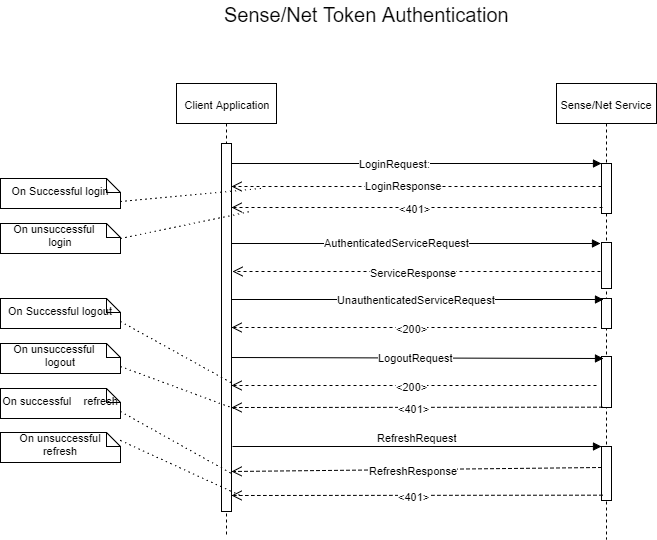

# Configuration of Web Token Authentication #

In the Sense/Net web application (on all instances) you need to configure the token authentication in the _web.config_ file.
in the sensenet section group find the _SymmetricKeySecret_ parameter in the tokenAuthentication section. Give it a value of random string in order to make the authentication work.

It is a must that all your instances in the NLB set have the same value for their SymmetricKeySecret parameter. If they have not, your authentication will not work. Also very important that keep this random string a secret, otherwise someone can exploit it as a security breach. It is a good practice to encrypt the whole tokenAuthentication section in the web.config file.

Example of token authentication configuration settings:
```xml
<sensenet>
...
   <tokenAuthentication>
     <add key="SymmetricKeySecret" value="<random secret string>" />
   </tokenAuthentication>
...
</sensenet>
```
There are a few other parameters in the tokenAuthentication section you can update to alter the behaviour of the token authentication:
```xml
<tokenAuthentication>
  <add key="SymmetricKeySecret" value="<random secret string>" />
  <add key="Audience" value="client" />
  <add key="Issuer" value="sensenet" />
  <add key="Subject" value="auth" />
  <add key="AccessLifeTimeInMinutes" value="5" />
  <add key="RefreshLifeTimeInMinutes" value="1440" />
  <add key="ClockSkewInMinutes" value="1"/>
</tokenAuthentication>
```
**_Audience, Issuer, Subject_**: environment constants to include in the token (further information at the end of the Token Authentication Protocol part)  
**_AccessLifeTimeInMinutes_**: the time span within the access token is valid from its creation  
**_RefreshLifeTimeInMinutes_**: the time span within the refresh token is valid from its creation  
**_ClockSkewInMinutes_**: the possible maximum difference in actual times between to servers

## Web Token Authentication Protocol ##
### Protocol overview ### 

The token authentication needs a user name and password pair for its first move. After it was given and the user was successfully identified, the service generates an access token and a refresh token and sends it to the client. The client can use the access token to get to the contents allowed only to authenticated users. Every token has its expiration time, so when the access token is expired the client cannot access protected content from that point. The client has to use the refresh token to obtain a new access token. When it is received, the client can use it to access contents again. Another thing is when the refresh token expires. In that case the client has to authenticate again with a user name and password and regain access to protected contents.

### Protocol use cases in detail ###

_Steps of an authentication process from the clients' point of view:_
1. Login with user name and password by basic authentication on the login endpoint
2. Receive a new access token and refresh token
3. Access the contents using the access token

_Steps of a token refresh process from the clients' point of view:_
1. Send the refresh token to the refresh endpoint
2. Receive a new access token
3. Access the contents using the access token

All the communication are sent through SSL (https). The used cookies are all HtmlOnly and Secure. There are two types of the communication: header marked and uri marked (without header mark). Either of them can be choosen freely by a client developer. However the two could be whimsically mixed, but we advice to choose one and stick to it.

 _figure 1: web token authentication protocol_

**LoginRequest with header mark:**  
_uri:_  
https://<yourhost>/<indifferentpath>  
_headers:_  
X-Authentication-Type: Token  
Authorization: Basic ```<base64CodedCredentials>```

**LoginRequest with uri mark:**   
_uri:_  
https://<yourhost>/sn-token/login  
_headers:_  
Authorization: Basic ```<base64CodedCredentials>```

**LoginResponse:**  
_cookies:_  
Set-Cookie: rs=```<refreshSignature>```  
Set-Cookie: as=```<accessSignature>```  
_body:_  
```json 
{"access":"<accessHeadAndPayload>", "refresh":"<refreshHeadAndPayload>"}
```

**AuthenticatedServiceRequest with header mark:**  
_uri:_  
https://<yourhost>/<contentpath>  
headers:  
```X-Authentication-Type: Token```  
```X-Refresh-Data: <refreshHeadAndPayload>```  
_cookies:_  
Cookie: rs=```<refreshSignature>```
Cookie: as=```<accessSignature>```

**AuthenticatedServiceRequest without header mark:**  
_uri:_  
https://<yourhost>/<contentpath>  
_headers:_  
```X-Access-Data: <accessHeadAndPayload>```  
_cookies:_  
Cookie: rs=```<refreshSignature>```  
Cookie: as=```<accessSignature>```

**UnauthenticatedServiceRequest:**  
_uri:_   
https://<yourhost>/<contentpath>  
_headers:_  
X-Access-Data: ```<expiredAccessHeadAndPayload>```

**ServiceResponse:**  
_body:_  
```<contentData>```

**RefreshRequest with header mark:**  
_uri:_  
https://<yourhost>/<indifferentpath>  
_headers:_  
X-Authentication-Type: Token  
X-Refresh-Data: ```<refreshHeadAndPayload>```  
_cookies:_  
Cookie: rs=```<refreshSignature>```  
Cookie: as=```<accessSignature>```

**RefreshRequest with uri mark:**  
_uri:_  
```https://<yourhost>/sn-token/refresh```  
_headers:_  
X-Refresh-Data: ```<refreshHeadAndPayload>```  
_cookies:_  
Cookie: rs=```<refreshSignature>```
Cookie: as=```<accessSignature>```

**RefreshResponse:**  
_cookies:_  
Set-Cookie: as=```<accessSignature>```  
_body:_  
```json 
{"access":"<accessHeadAndPayload>"}
```

**<200>:**  
HTTP response with status 200 (OK). In the figure it is used to sign an empty response, in case of a not authenticated request. It is important, that Sense/Net does not throw an exception here.

**<401>:**  
HTTP response with status 401 (Unauthorized). In the figure it is used to sign a response to an unsuccessful login or refresh request.

### The used headers in detail ###  
**_Authorization_**: this header is a standard HTTP header and tells the service, that a client would like to authenticate. Its value always begins with "Basic ", that signes a basic type authentication requires a valid user name and password.  
**_X-Access-Data_**: this header tells the service, that a client tries to access a content with token. Its value is an access token head and payload.  
**_X-Authentication-Type_**: this header tells the service in case of header marked communication, that a token authentication is requested. its value is always "Token".  
**_X-Refresh-Data_**: this header tells the service, that a client tries to refresh its expired access token. Its value is a refresh token head and payload.

### The used cookies ###  
**_as, rs_**: technical HttpOnly and Secure cookies for token authentication. They are emitted by token authentication service. The client does not need them and they are not subjects of change.

```<refreshSignature>, <accessSignature>```: signature strings, used by the authentication service.  
```<accessHeadAndPayload>, <refreshHeadAndPayload>```: base64 and URL encoded strings.

The access head and payload is the public part of a token, that put together from two parts separated by a full stop.
The first is a technical like header that you do not have to care about. The second - the payload - contains claims about the authenticated user and some authentication concerning data. The payload once it is decoded from the base64 string is a JSON object's string representation, so it can be easily read out in Javascript.

**Example of a typical payload:**  
```json
{"iss":"sensenet-token-service","sub":"sensenet","aud":"client","exp":1490577801,"iat":1490577501,"nbf":1490577501,"name":"Joe"}
```

### The used claims in the Sense/Net tokens:
**_iss_**: issuer identifies the principal that issued the token  
**_sub_**: subject identifies the principal that is the subject of the token  
**_aud_**: audience identifies the recipients that the token is intended for  
**_exp_**: expiration time identifies the expiration time on or after which the token will not be accepted  
**_iat_**: issued at identifies the time at which the token was issued  
**_nbf_**: not before identifies the time before which the token will not be accepted  
**_name_**: name identifies the name of the user whom the token was issued to

The _iss, sub, aud_ claims can be configured and remains the same unless you change them in the web.config. The other claims dinamically change on new token creation.

## Considerations for client developers ##

Once the client application has got the access token and the refresh token, it has to persist them preferably in some local browser storage for later usage. However the refresh token also contains the same claims as the access token its claims - at least the _iat, nbf_ and _exp_ claims - have different values. It happens because of their different use. An access token immediately valid and accepted after its creation, but the refresh token is not. The later becames valid and accepted by the service only when the access token is expired. Therefore the client should extract the expiration time of the tokens into an application lifetime variable and constantly check it before any try of a content access. Content access request must include the access token into the according HTTP header (specified as _AuthenticatedServiceRequest_ earlier). In case the access token expiration check result true the client must check the refresh token's expiration. If this results false, the client have to send a _RefreshRequest_ (specified earlier) to the service. A _RefreshRequest_ will response with a new access token, that must replace the old one. If the check results true, there is no means a client can access protected contents unless it requires the user name and password from its user and sends a new _LoginRequest_ to the service. Because of the sensitive nature of the user's credentials, we do not recommend the client to persist them. As the lifetime of both tokens can be changed in the service's configuration, it is very important to choose them wisely to support the fluent communication between the two party. A wrong settings on them can disrupt efficiency of turn arounds and slow down the whole system.