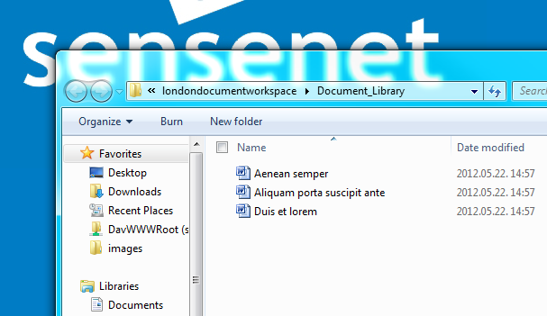

# Webdav

sensenet ECM provides a way to access your content via webdav, allowing Microsoft Office, Windows Explorer, Total Commander, Visual Studio, etc to open and edit content residing in a sensenet [Content Repository](content-repository.md). The [Content Repository](content-repository.md) can be even mapped as a drive. Office documents can be opened directly from the portal surface with webdav. When a document opened via webdav is saved, it is automatically versioned, permissions are automatically checked, etc. Drag and drop move and copy also works.

### Installation

Webdav automatically works in sensenet ECM, but there are a few things you may have to configure before you can access your [Content Repository](content-repository.md) as a file system.

#### Authentication

sensenet supports the following authentication schemes with webdav:

- **Windows authentication**
  Set up both your Sense/Net Site to use Windows authentication, and your IIS web site to allow Windows authentication. Make sure your AD user is present in the [Content Repository](content-repository.md) under the appropriate domain. You will be able to access the [Content Repository](content-repository.md) using your AD user and password.

- **Basic authentication**
  Set up your sensenet Site to use Forms authentication, and your IIS web site to allow Anonymous authentication only (do not allow Windows in IIS and allowing Basic is not necessary). You will be able to access the [Content Repository](content-repository.md) using your portal user and password. Please note that operations that use Basic authentication over a non-SSL HTTP connection are disabled by default by your operating system. To enable webdav for non-SSL sites with Basic authentication refer to the following article:  [http://support.microsoft.com/kb/2123563](http://support.microsoft.com/kb/2123563).

> Please note that support for Basic authentication has been introduced in sensenet ECM 6.1. Any versions prior must use Windows authentication for using webdav.

 ##### Webdav publishing

Make sure you don't have Webdav publishing installed, as it may interfere with sensenet webdav features.

### Opening a document library in Windows Explorer

```diff
- Please note, that this feature works with Internet Explorer versions prior to 11 only.
```

To open a sensenet ECM document library in Windows Explorer navigate to the document library and select the **Open in Windows Explorer** action from the Actions menu:


The contents of the document library will appear as folders and files opened in Windows Explorer:



### Opening Office documents

Managing workspace documents using Microsoft Office is a common feature of Enterprise Content Management Systems. Using sensenet ECM you are able to create, modify or delete workspaces within Office. Opening and saving documents is also done using the webdav protocol. To open a document click the **Edit in Microsoft Office** action on the document:


For more info on managing Office documents in the sensenet [Content Repository](content-repository.md) within Microsoft Office please read the following article:

- [Managing Documents from Microsoft Office](managing-documents-from-microsoft-office.md)

### Mapping the Content Repository to a network drive

It is also possible to map the full sensenet [Content Repository](content-repository.md) to a network drive. To do this first click the **Map network drive...** link on the Computer in the Windows Start menu:


Select a suitable drive letter and enter the web address of your sensenet site:


After clicking Finish the [Content Repository](content-repository.md) should appear in Windows Explorer:


From here onwards you can use this drive to manage your [Content Repository](content-repository.md): uploading, editing, deleting, renaming content can be done just like using a normal file system.

### Uploading different file types

The sensenet [Content Repository](content-repository.md) is much more than a simple file system. It can distinguish between different file types. An image for example in a regular file system is a simple file with .png or .jpg extension, an image in the sensenet [Content Repository](content-repository.md) however is an content of Image type, which is derived from the File type. Therefore when using the [Content Repository](content-repository.md) via webdav it is desired to make connections between files with different extensions and [Content Repository](content-repository.md) types. This is done with the same web.config setting that is used by the upload function on the ui:

```xml
<sensenet>
  <uploadFileExtensions>
    <add key=".jpg" value="Image"/>
    <add key=".jpeg" value="Image"/>
    <add key=".gif" value="Image"/>
    <add key=".png" value="Image"/>
    <add key=".bmp" value="Image"/>
    <add key=".xaml" value="WorkflowDefinition"/>
  </uploadFileExtensions>
```

For example when dropping a file with .png extension the content created in the sensenet [Content Repository](content-repository.md) will be of Image type.

### Configuration

The configuration for webdav can be found in the web.config under the `webdavSettings` section:

```xml
<sensenet>
  <webdavSettings>
    <add key="MockExistingFiles" value="desktop.ini,Thumbs.db,wdmaud.drv,foo,MSGRHU32.ini"/>
    <add key="WebdavDefaultPageTemplate" value="Internet_Page.html"/>
  </webdavSettings>
```

The following options can be set:

- **MockExistingFiles**: some versions of webdav clients shipped with Windows will automatically probe on certain files and will fail to continue if those files are not present. Since these files are never present in a sensenet [Content Repository](content-repository.md), the webdav handler mocks these files as if they existed there to ensure flawless operation. These files may vary from system-to-system, so if you experience any problems with opening sensenet [Content Repository](content-repository.md) folders via webdav it is possible that your webdav client is looking for files not present in the [Content Repository](content-repository.md). Use fiddler or a debug version of sensenet ECM with dbgview to detect this situation and extend this list with the file names to be mocked as existing.

- **WebdavDefaultPageTemplate**: if you upload an aspx file the pagetemplate of the created sensenet Page will be the one specified with this option.

## Custom WebDav provider

It is possible to customize the behavior of the WebDav feature by developing a custom provider. Developers can restrict what users see in Windows Explorer and what they can do with files and folders.

- [How to create a custom WebDav provider](http://community.sensenet.com/tutorials/how-to-create-a-custom-webdav-provider)